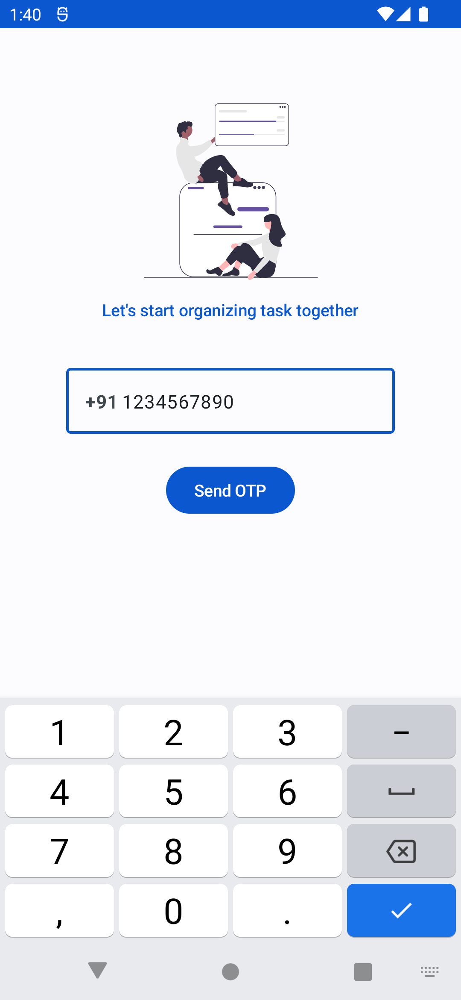
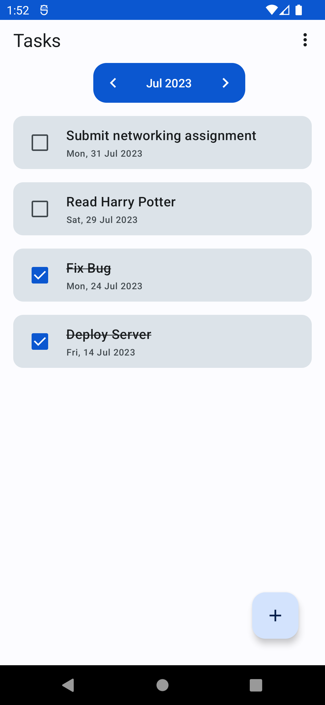
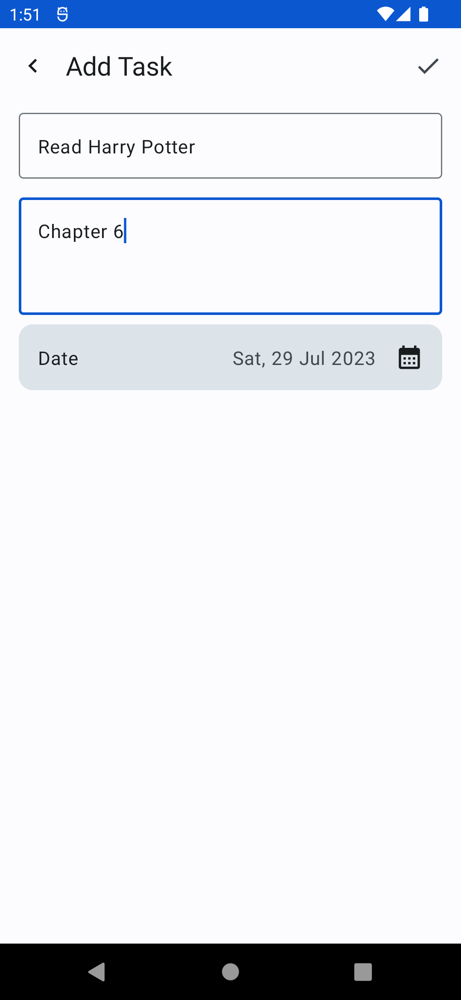

# TaskSprint

A simple todo app with date pagination backed by firebase. It is built in compose
and follows MVVM architecture, UDF pattern and Single Activity architecture. It uses
firebase phone authentication.

## Feature

1. Firebase Phone Authentication in a clean architecture.
2. Add/Update/Delete Task using firebase firestore.
3. Pagination: Load task according to month.

## Screenshots

|                               |                               |                                    |
|-------------------------------|-------------------------------|------------------------------------|
|  |  |  |

## Build with

[Kotlin](https://kotlinlang.org/): As the programming language.  
[Jetpack Compose](https://developer.android.com/jetpack/compose): To build UI.  
[Jetpack Navigation](https://developer.android.com/guide/navigation): To navigate between screens.  
[Firebase Firestore](https://firebase.google.com/docs/firestore): As the database.  
[Firebase Phone Auth](https://firebase.google.com/docs/auth/android/phone-auth): To authenticate
user using phone number.  
[Timber](https://github.com/JakeWharton/timber): For Logging.  
[maxkeppeler sheets](https://github.com/maxkeppeler/sheets) : To create date picker dialog.

## Using instruction

1. Enter your phone number. It will open browser for captcha verification. After that,
   a verification will be sent to you phone number. Enter it and log in.
2. Add new task using + button and start using the app.

## Installation

1. Create a firebase project.
2. Extract SHA1 and SHA256 and add it in the firebase project SHA certificate fingerprints.
3. Clone and open this project in AndroidStudio.
4. Connect this project with the firebase project that was created in step 1.

## Architecture

This app follows MVVM architecture, Unidirectional data flow (UDF) pattern and Single Activity
architecture.

## Folder Structure

- `core`: Handles the backend of the app like authentication and database related work.
- `ui`: Handles the user interface components.
- `common`: Includes utility classes and helper functions used across the app.
- `di` : Contains hilt modules.